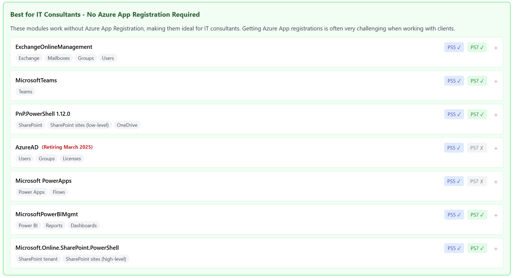

# Microsoft 365 PowerShell Modules Reference Guide

A visual comparison tool for IT consultants to quickly identify the right PowerShell module for Microsoft 365 administration tasks. This interactive guide helps you understand module capabilities, authentication requirements, and compatibility at a glance.

  

## Screenshot

